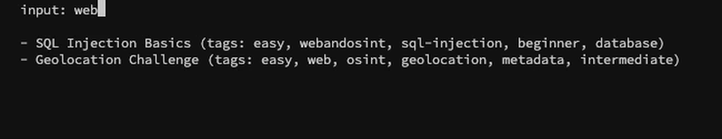

# SearchAll: Search All CTF Challenges

CTF 問題のタグ検索ツールです。



## 機能

- 指定されたタグが含まれるチャレンジを検索
- 複数のタグを同時に検索可能

このツールには 2 つの機能が含まれます。

- **インタラクティブ検索モード**: 引数なしで実行すると、リアルタイムでタグをフィルタリング
- **静的検索モード**: 引数ありで実行すると、指定されたタグで即座に検索して出力

## セットアップ

1. download dependencies

```bash
go mod download
```

2. build

```bash
go build -o searchall
```

## 使用方法

```bash
# 引数なしで実行すると、インタラクティブ検索モードに入ります
$ ./searchall

# 静的検索モード
$ ./searchall medium
- "Social Media Investigation"

# 複数のタグを指定して検索も可能
$ ./searchall sql-injection geolocation
- "SQL Injection Basics"
- "Geolocation Challenge"
```
